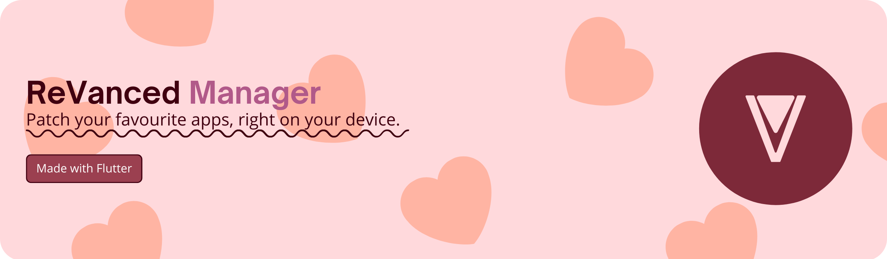

### 👋 Hello there! (this is somewhat dead account)

 

My name is EvadeMaster on GitHub, a nerdy student from Thailand who started coding as a hobby!

Here are my favourite things to do!

- 🎉 I like to add emojis to my commit.
- 👀 I’m interested in Flutter projects.
- ⏳ I like to code in Python during my free time.
- 📜 I enjoy contributing to random stuff.
- 🎨 I'm obsessed with colour.
- 🗿 Moyai.

I'm not fluent in English, but at least I tried!

### ReVanced

<picture>
  <a target="_blank" href="https://github.com/revanced/revanced-manager"><source media="(prefers-color-scheme: dark)" srcset="ReVancedManager/dark.png">
  <a target="_blank" href="https://github.com/revanced/revanced-manager"><source media="(prefers-color-scheme: light)" srcset="ReVancedManager/light.png">
  
</picture>

### Contribution

<!--

Lorem ipsum dolor sit amet, consectetur adipiscing elit, sed do eiusmod tempor incididunt ut labore et dolore magna aliqua. Quis risus sed vulputate odio ut enim. Leo urna molestie at elementum eu. Mattis enim ut tellus elementum sagittis vitae et leo duis. Ultrices in iaculis nunc sed augue lacus viverra vitae congue. Amet risus nullam eget felis eget nunc. Mattis aliquam faucibus purus in massa tempor. Augue mauris augue neque gravida in fermentum et. Nisi est sit amet facilisis magna etiam tempor orci. In ante metus dictum at tempor commodo. Platea dictumst quisque sagittis purus sit amet.

-->

###### I hate git
